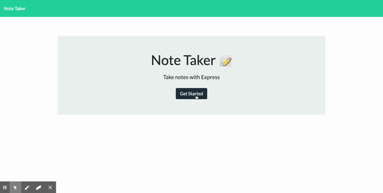

# Note Taker   

## Description  
A simple application built with Node JS and Express. The app saves any notes a user enters with a note title and note decription. The user can save and delete any notes at any time. Any notes saved will still be available upon a page reload. 

## Table of Contents  
* [Installation](#installation)  
* [Usage](#usage)  
* [Credits](#credits)  
* [Testing](#testing)  
* [Questions](#questions)  

## Installation  
Application runs in the browser, no downloads or intalls necessary.  

## Usage  
This application is using JavaScript, a json database, html, css and express. It uses a server.js file to set up client and api routes. The api routes are GET, POST, and DELETE methods to link the front and back end, allowing the user to add notes and delete them as they please. The client side index.js uses fetch methods to send and recieve info from the rest api. When the user saves a new note, that note is saved to a db.json file within the application's directory. This app also uses nano id to assign a unique id to each note saved. Each note is targeted by id to delete it on the back end!  

## Credits  
[Build a REST API with node js & Express tutorial](https://youtu.be/pKd0Rpw7O48)    

## Testing  
No tests needed  

## Questions  
Contact information for any questions about this application:
* https://github.com/lucahendicott  
* lucahdavid88@gmail.com  

## Deployed Application
[Save some notes!](https://lucah-note-taker.herokuapp.com/)
